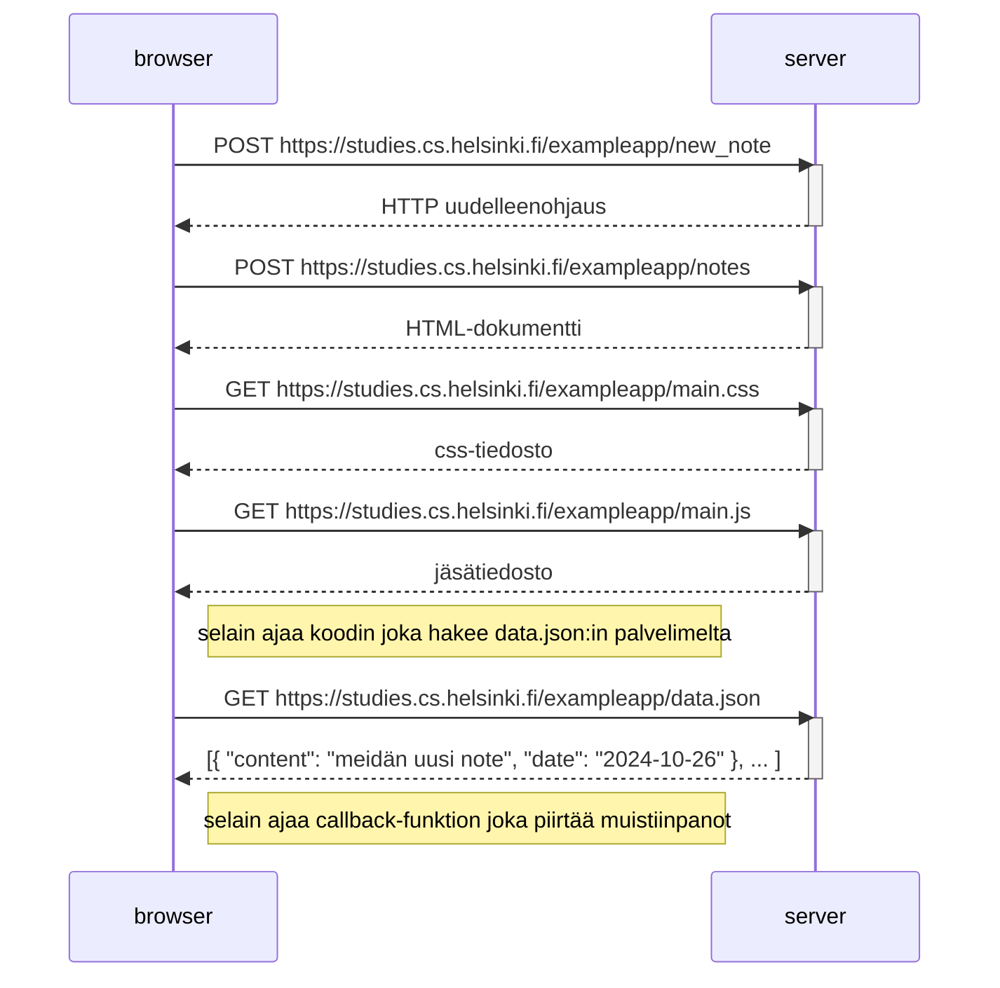

```mermaid
sequenceDiagram
    participant browser
    participant server

    browser->>server: POST https://studies.cs.helsinki.fi/exampleapp/new_note
    activate server
    server-->>browser: HTTP uudelleenohjaus
    deactivate server

    browser->>server: POST https://studies.cs.helsinki.fi/exampleapp/notes
    activate server
    server-->>browser: HTML-dokumentti
    deactivate server

    browser->>server: GET https://studies.cs.helsinki.fi/exampleapp/main.css
    activate server
    server-->>browser: css-tiedosto
    deactivate server

    browser->>server: GET https://studies.cs.helsinki.fi/exampleapp/main.js
    activate server
    server-->>browser: jäsätiedosto
    deactivate server

    Note right of browser: selain ajaa koodin joka hakee data.json:in palvelimelta

    browser->>server: GET https://studies.cs.helsinki.fi/exampleapp/data.json
    activate server
    server-->>browser: [{ "content": "meidän uusi note", "date": "2024-10-26" }, ... ]
    deactivate server

    Note right of browser: selain ajaa callback-funktion joka piirtää muistiinpanot
```
